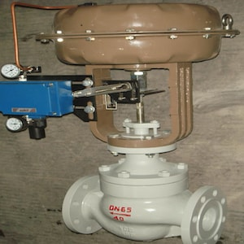
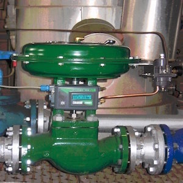
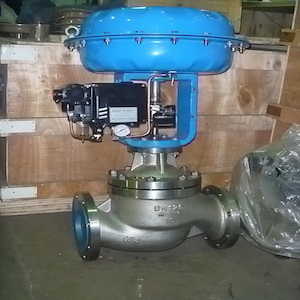
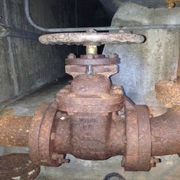
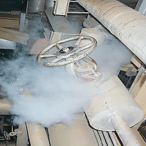
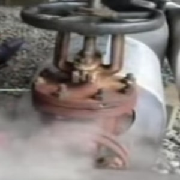
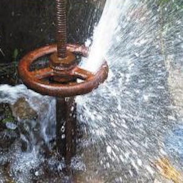
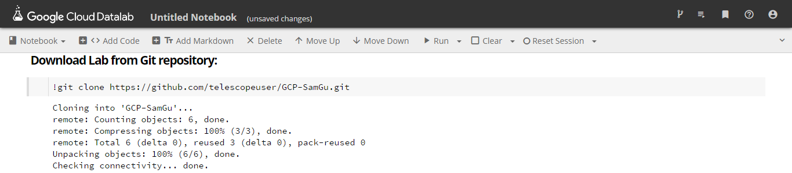
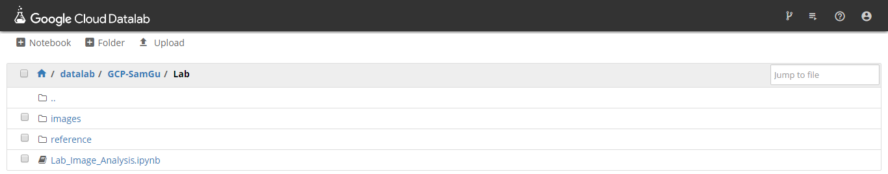

Firstly, please open this README document using your own web browser: https://github.com/telescopeuser/GCP-SamGu

**Video lecture at:** YouTube [To be announced]

**Lecture notes at:** Notes\Notes_Image_Analysis.pdf

**Lab python notebook at:** Lab\Lab_Image_Analysis.ipynb

# < Using Deep Learning and Transfer Learning to Conduct Customized Image Analysis >

by: **Sam Gu** [ Data Science Trainer ]

May 2017

# 1. Lecture: Agenda

**Refer to lecture notes: Notes/Notes_Image_Analysis.pdf**

* Deep Learning Basics for Image Analysis
* Real World Image Analysis Needs
* Idea of Transfer Learning
* Architecture of Transfer Learning
* Hands-on Datalab Workshop on GCP

# 2. Lab: Hands-on Datalab Workshop on GCP

**Refer to lab workshop: Lab/Lab_Image_Analysis.ipynb**

Credit: This python notebook was adapted based on: https://www.kernix.com/blog/image-classification-with-a-pre-trained-deep-neural-network_p11

### Image Analysis Lab
### Detect Normal or Abnormal Industrial Valves, Using Transfer Learning Technology upon Google's Pre-Trained Deep Neural Network

The use case here is to use drone to provide regular surveillance on remote or dangerous areas, capturing image of industrial equipment like valves, them steam the image back for automatic malfunction diagnosis, using machine intelligence. This improves safety and efficiency compared to current human-involved processes, without large investment on wired sensor infrastructure. The core part of this solution involves advanced image analysis in real world.

In this lab, you will carry out a transfer learning example based on Google Inception-v3 image recognition neural network.

### Normal Valves:

---

---

---

---

---

---

---

### Abormal Valves:

---

---

---

---

---

---

---

### In this Lab, you will learn:
* Explore images in customer’s industry.
* Reposition a pre-trained deep neural net for new image recognition task.
* Perform feature extraction.
* Obtain deep feature representation of customer’s original image.
* Train a simple machine learning model for new classification task.
* Evaluate results of this transfer learning model.

### Prerequisites:
* Google Cloud Platform Account
* Basic working knowledge of GCP, Datalab and Python

# 3. Environment Setup for: Hands-on Datalab Workshop on GCP

* Login Google Cloud Platform to start Datalab.

* Create a new notebook to download this lab by running command: 
> !git clone https://github.com/telescopeuser/GCP-SamGu.git

* Go to folder **GCP-SamGu/Lab/**, then open notebook **Lab_Image_Analysis.ipynb** to follow.

### Reference:
* Google Cloud Platform Free Registration: https://cloud.google.com/free/
* Google Datalab Quick Start: https://cloud.google.com/datalab/docs/quickstarts
        

### Google Deep Neural Network: Inception-v3:

# 4. Congratulations! You are now equipped with practical skills to carry out deep leaning image analysis in real world!

### You have learnt:
* Deep Learning Basics for Image Analysis
* Real World Image Analysis Needs
* Idea of Transfer Learning
* Architecture of Transfer Learning
* Hands-on Datalab Workshop on GCP
